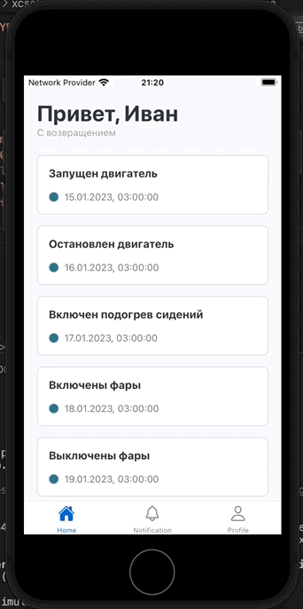

# TesLabChallengeApp

Данное приложение создано в рамках тестового задания:
- Имеет три роута (Home, Notifications, Profile)
- Home: Получение и отображение списка событий с помощь react-query (лучший способ, имхо)
- Notifications: Получение и отображение списка уведомлений и хранение их в redux
- Profile - отображение данных о пользователе из статики в redux store

## Table of Contents

- [Features](#features)
- [Prerequisites](#prerequisites)
- [Installation](#installation)
- [Usage](#usage)
- [Demo](#demo)


## Features

- Fetch events and notifications from an API
- Pull-to-refresh to update the notifications list
- Automatic updates every 30 seconds
- Uses react-query
- Uses Redux for state management

## Prerequisites
- node version >= 18
- ruby version >= 2.7
- Java >= 17
- Cocoapods >= 1.13

## Installation

1. Clone the repository:

    ```sh
    git clone https://github.com/digdas/TesLabChallengeApp.git
    cd TesLabChallengeApp
    git checkout development
    ```

2. Install dependencies:

    ```sh
    npm install
    ```

3. Install pods:

    ```sh
    cd ios
    pod install
    ```

4. copy and fill .env.example:

## Usage

1. Start the Metro bundler:

    ```sh
    npx react-native start
    ```

2. Run the app on your preferred platform:

    ```sh
    npx react-native run-android
    # or
    npx react-native run-ios
    ```

## Demo

<p align="center">
  
</p>